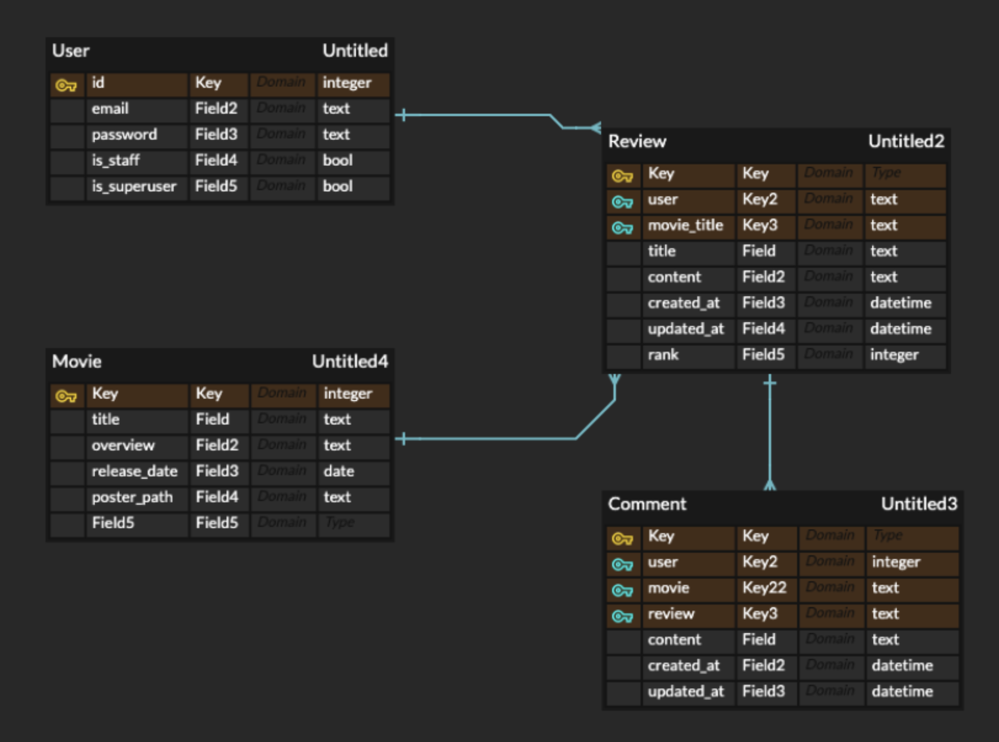
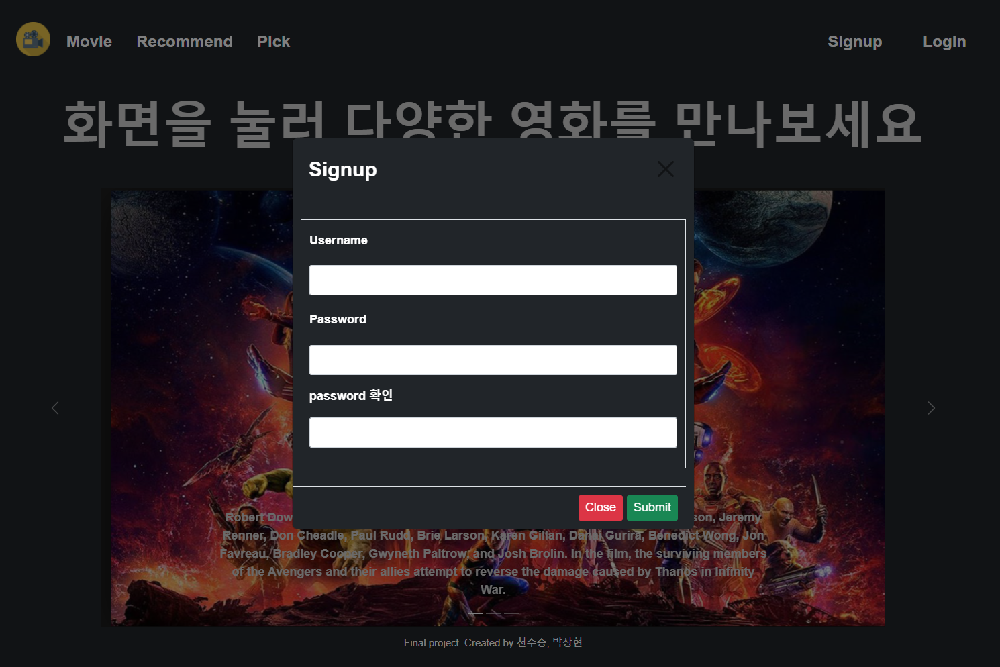
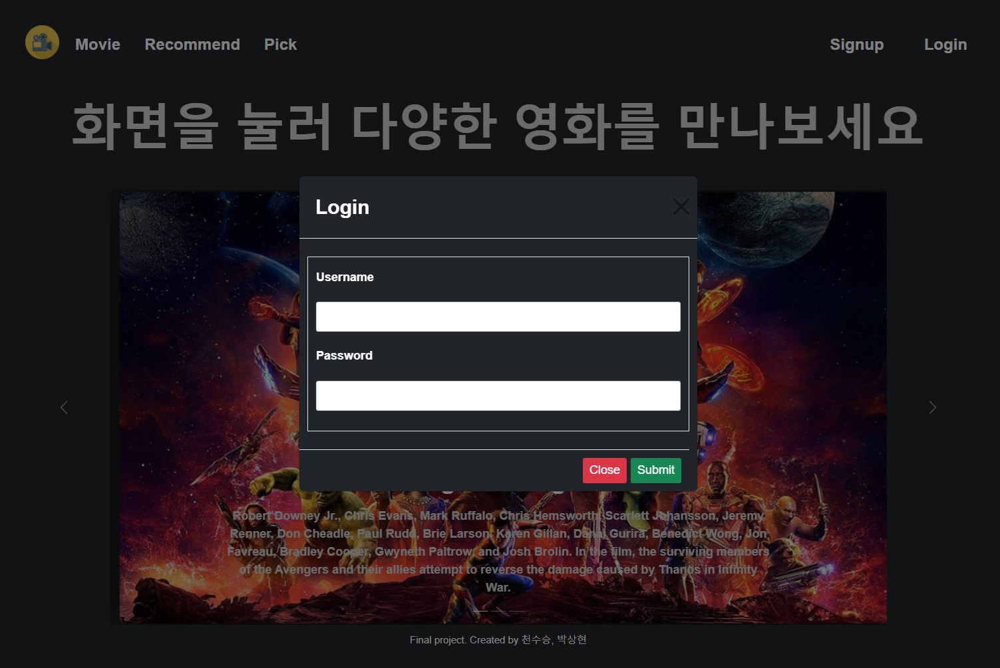
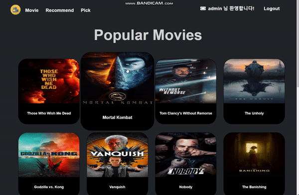
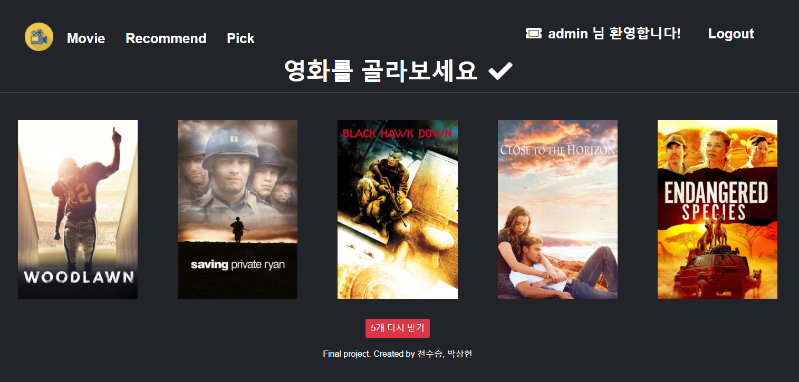
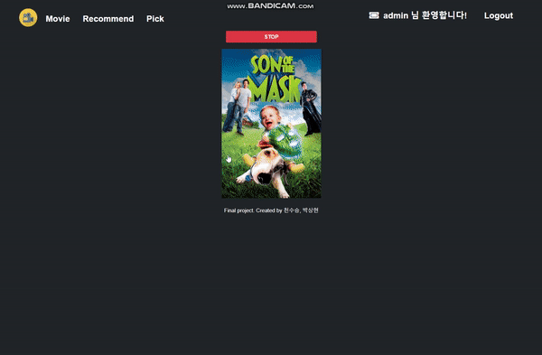
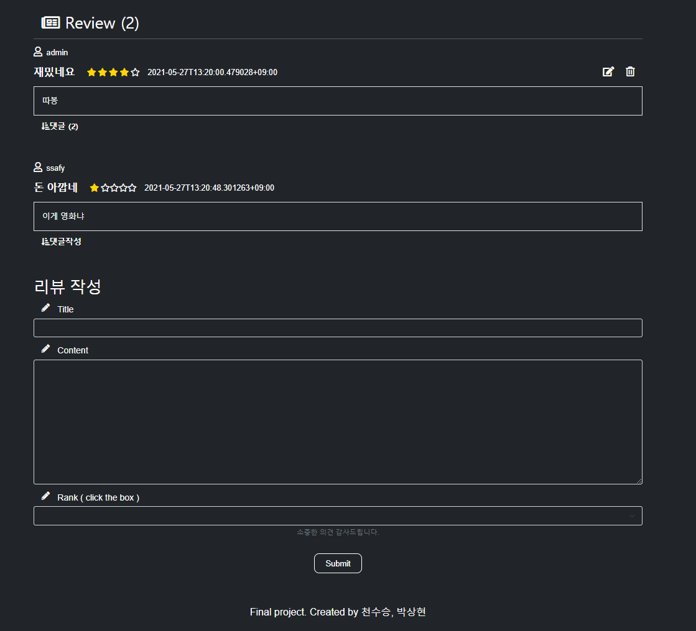
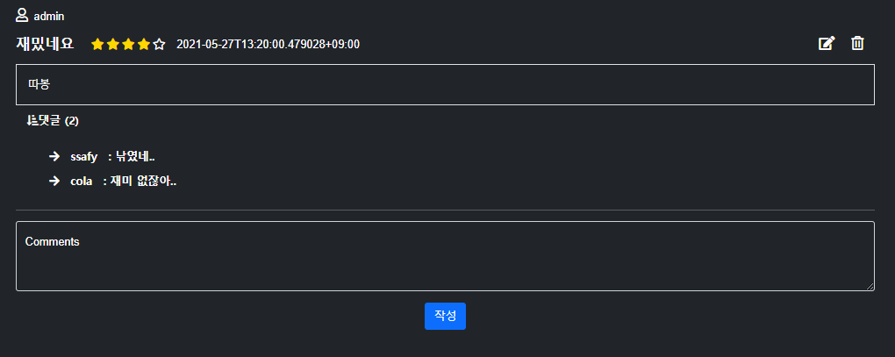

# SSAFLIM

>영화 정보 기반 추천 서비스 구성
>
>커뮤니티 서비스 구성
>
>HTML, CSS, JavaScript, Vue.js, Django, REST API, DataBase 등을 활용한 실제 서비스 설계
>
>서비스 관리 및 유지보수


## 1. 업무 분담


|  팀원  |                         업무내용                         |
| :----: | :------------------------------------------------------: |
| 천수승 | CSS 및 화면 레이아웃 관리,  추천영화 서비스 구현, 디버깅 |
| 박상현 |     데이터 수집 및 관리, 회원 관리 및 커뮤니티 관리      |


## 2. Model





## 3. URL


|  HTTP verb   |                    URL 패턴                     |                설명                 |
| :----------: | :---------------------------------------------: | :---------------------------------: |
|     POST     |                accounts/signup/                 |              회원가입               |
|     GET      |                 accounts/users/                 |         모든 username 출력          |
|     GET      |                     movies/                     |           영화 정보 출력            |
|     GET      |                   movies/pk/                    |         상세 영화정보 출력          |
|  GET & POST  |            movies/movie_pk/reviews/             | 해당 영화의 전체 리뷰 조회 및 생성  |
| PUT & DELETE |       movies/movie_pk/reviews/review_pk/        | 해당 영화의  단일 리뷰 수정 및 삭제 |
|  GET & POST  |       movies/movie_pk/review_pk/comments/       |    리뷰의 전체 댓글 조회 및 생성    |
| PUT & DELETE | movies/movie_pk/review_pk/comments/comments_pk/ |       단일 댓글 수정 및 삭제        |
|     GET      |                movies/recommend/                |          랜덤 5 Pick 기능           |
|     GET      |               movies/recommended/               |           랜덤 Pick 기능            |


## 4. Vue ( Client )


### Ⅰ. 홈화면 입장


- `Gate.vue`를 통해 홈화면으로 입장
  - 영화 로고 클릭시 `Gate.vue`가 호출 되어 홈화면으로 돌아온다.
- `NavBar`
  - 링크를 통해 클릭시 해당 `Vue`가 호출 된다.
- `Carousel`
  - 미리 가져온 고화질의 사진을 이용해 Bootstrap의 Carousel을 사용
  - 하나의 프레임마다 0.5초씩 시간을 두었다.


### Ⅱ.  SignUp





- `Username`, `Password`, `password`확인을 입력 후 장고 서버로 요청을 보낸다.
- 해당 요청이 잘 못된다면 `alert()`를 통해 `다시 입력해주세요` 라는 경고창이 호출된다.


### Ⅲ. Login





- `Username`과 `Password` 입력 후 장고 서버로 요청을 보낸다.
- `obtain_jwt_token` 를 통해 `JWT Token`을 받아 `localStorage`에 저장한다.
- `localStorage`에 `JWT Token` 토큰이 남아 있다면 로그인 상태가 유지된다.


### Ⅳ. Popular Movies





- `NavBar` 의  `Movie` 클릭 시 이동

- 영화 포스터에 마우스 오버시 포스터가 확대한다.

- `Paginator`를 통해 스크롤이 하단에 도착 시 장고로 요청을 보내고 20개씩 새로운 영화를 가져온다.

  


### Ⅴ. Recommend 





- `NavBar` 의  `Recommend` 클릭 시 이동
  - 이동 후 장고 DB에 있는  영화들을 받아와 랜덤으로 5개 나열한다.
- 이미지 클릭 시 해당 영화의 상세 정보를 볼 수 있는 `Detail.vue`로 이동하게 된다. 


### Ⅵ. Pick





- `NavBar` 의  `Pick` 클릭 시 이동
- 화면 이동 시 장고로 요청을 보내 DB에 있는 영화들을 가져온다
- 가져온 영화들을 랜덤적으로 하나씩 선출한다.
- 버튼을 누르기 전까지 새로운 영화가 랜덤으로 나오도록 재귀로 돌렸다.
- `STOP` 버튼 클릭 시 `Detail.vue`로 이동해 해당 영화의 상세정보를 보여준다.


### Ⅶ. Community








- 로그인시 댓글 폼과 리뷰 폼이 보여진다.

- 리뷰와 댓글 작성 시 장고로 요청을 보낸다.

  - 작성하지 않으면 실패

- 정상 요청 시 리뷰와 댓글들의 정보를 다시 불러온다.

  


## 5. Django (Server)


### Ⅰ. Model과 Serializer


- 리뷰와 댓글을 작성한 사용자를 보여주기 위해 `username`과 `id`를 응답할 수 있도록 `UserInfoSerializer`를 만들었다.

```python
class UserInfoSerializer(serializers.ModelSerializer):

    class Meta:
        model = User
        fields = ('username', 'id')
```


- `Movie.vue`에서 영화 포스터를 보여주기 위해 `MovieListSerializer`를 작성
- `Detail.vue`에 필요한 정보들을 보내주기 위해 `MovieSerializer` 작성
- 리뷰들을 보여주기 위한 `ReviewListSerializer` 작성
- 댓들들을 보여주기 위한 `CommentListSerializer` 작성


### Ⅱ.  Paginator


- 스크롤이 하단 끝까지 내려갔을시 TMDB에 요청을 보내 영화들의 정보를 응답받아 DB에 저장한다.
- 저장한 영화들을 스크롤 내리면 `Movie.vue`에서 20개씩 보여준다.
- 처음 `Movie.vue`를 불러올 때 DB에 아무것도 없는 것을 방지 하기 위해서 `Movie` 모델의 길이를 구했다.
  - 길이가 0이라면 무조건 TMDB에 요청을 보내 영화 정보를 DB에 저장한다.


```python
movies = Movie.objects.order_by('pk')
paginator = Paginator(movies, 20)
page_number = request.GET.get('page')
movies = paginator.get_page(page_number)

serializer = MovieListSerializer(movies, many=True)
return Response(serializer.data, status=201)
```


### Ⅲ. Recommend & Pick


- 랜덤으로 영화를 뽑아주기 위해 DB에 저장된 영화의 정보 전체를 응답으로 보내준다.
- 보내준 데이터를 `Client` 측에서 랜덤으로 뽑고 화면에 레이아웃 시키다.


```python
@api_view(['GET'])
def recommend(request):
    movies = Movie.objects.all()
    serializer = MovieListSerializer(movies, many=True)
    return Response(serializer.data, status=201)
```


### Ⅳ. 가상환경변수 활용


- KEY 값을 다른 사람이 보지 못하게 환경 변수로 설정해서 사용하였다.


```bash
pip install django-environ
```

**.env** 파일 생성

```
VUE_APP_TMDB_KEY="de5f043a3d3efa344f61dc9f91c892b5"
```

**settins.py**

```python
env = environ.Env()
# reading .env file
environ.Env.read_env()
TMDB_KEY = env('TMDB_KEY')
```


### Ⅴ. JWT_Token


- 회원 인증을 위해 JWT_Token을 사용

```python
pip install djangorestframework_jwt
```

urls.py

```python
from rest_framework_jwt.views import obtain_jwt_token
urlpatterns = [
    path('api-token-auth/', obtain_jwt_token),
]
```


## 6. 기타 CSS


#### Bootstrap 사용

https://getbootstrap.com/

#### Fontawesome 사용

https://fontawesome.com/v5.15/icons?d=gallery&p=2